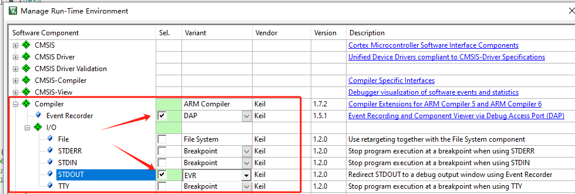
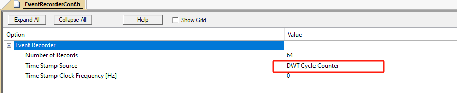

### eventRecord use

#### step
1. keil pack setting

2. eventRecord component setting

3. include file **EventRecorder.h** and intialize component
```
  EventRecorderInitialize(EventRecordAll, 1U);
  EventRecorderStart();
  printf("log");
```
4. debug view setting
 - enable **periodic windows update**
 - enable **analysis->event Recorder**
 - enable **serial windows->debug viewer**
 [!NOTE] 
    do not use arm6 complier
