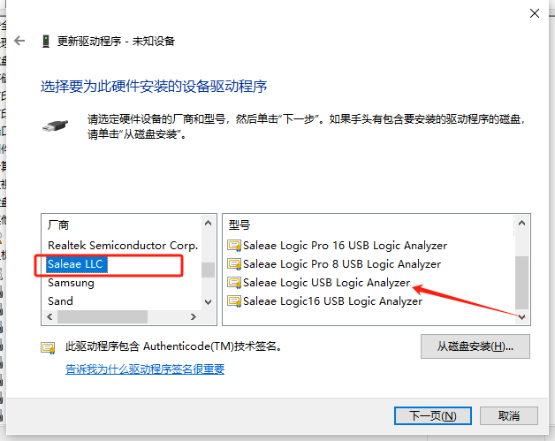

### 山寨版24MHz逻辑分析仪无法正常识别解决方法
 - 设备管理器中选中未知设备右击选择更新驱动
 
 - 定位本地驱动路径
  
 - 选择设备类型
   
 - 厂商列表找到厂商Saleae LLC，以及选择对应的设备型号
    
 - 最终可以看到设备正常识别，软件能检测到设备接入
    
 
 #### 官方软件使用注意事项！！！
    不要更新软件到新的版本，该设备无法被更新版本的软件识别